# Tabler-Icons - Page 55

This page references SVG files under `etc/resources/aws/svg/Tabler-Icons`.
Each card shows the SVG preview first and the XAL tag syntax in the Code tab.
Showing 4861-4950 of 4964 SVG files.

<style>
.xal-ref-grid{display:grid;grid-template-columns:repeat(3,minmax(0,1fr));gap:1rem;margin:1rem 0 1.5rem}.xal-ref-card{border:1px solid var(--table-border-color);border-radius:8px;overflow:hidden;background:var(--bg);padding:.75rem}.xal-ref-title{font-size:.9rem;font-weight:600;line-height:1.25;margin:0 0 .5rem;overflow-wrap:anywhere}.xal-ref-preview{display:flex;align-items:center;justify-content:center}.xal-ref-preview img{display:block;width:100%;height:auto}.xal-ref-card pre{margin:0;max-height:18rem;overflow:auto;white-space:pre}.xal-ref-card code{font-size:.78em}.xal-ref-tag{margin:.5rem 0 0;color:var(--fg);opacity:.72;overflow:auto;white-space:pre}.xal-ref-tag code{font-size:.72em}@media(max-width:900px){.xal-ref-grid{grid-template-columns:repeat(2,minmax(0,1fr))}}@media(max-width:560px){.xal-ref-grid{grid-template-columns:1fr}}
</style>

[Back to section index](tabler-icons.md)

<div class="xal-ref-grid">
<div class="xal-ref-card">
<div class="xal-ref-title">wave-sine</div>

{{#tabs name="svg-ref-4860"}}
{{#tab name="Preview"}}
<div class="xal-ref-preview">
<div>
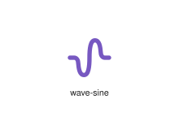
</div>
</div>

{{#endtab}}
{{#tab name="Code"}}

```xml
{{#include ../samples/icons/Tabler-Icons/wave-sine-47eef752.xal}}
```

{{#endtab}}
{{#endtabs}}

<div class="xal-ref-tag"><code>&lt;item id=&#34;104860&#34; /&gt;</code></div>

</div>
<div class="xal-ref-card">
<div class="xal-ref-title">wave-square</div>

{{#tabs name="svg-ref-4861"}}
{{#tab name="Preview"}}
<div class="xal-ref-preview">
<div>
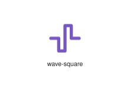
</div>
</div>

{{#endtab}}
{{#tab name="Code"}}

```xml
{{#include ../samples/icons/Tabler-Icons/wave-square-03c248bb.xal}}
```

{{#endtab}}
{{#endtabs}}

<div class="xal-ref-tag"><code>&lt;item id=&#34;104861&#34; /&gt;</code></div>

</div>
<div class="xal-ref-card">
<div class="xal-ref-title">waves-electricity</div>

{{#tabs name="svg-ref-4862"}}
{{#tab name="Preview"}}
<div class="xal-ref-preview">
<div>
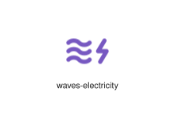
</div>
</div>

{{#endtab}}
{{#tab name="Code"}}

```xml
{{#include ../samples/icons/Tabler-Icons/waves-electricity-8c1a194a.xal}}
```

{{#endtab}}
{{#endtabs}}

<div class="xal-ref-tag"><code>&lt;item id=&#34;104862&#34; /&gt;</code></div>

</div>
<div class="xal-ref-card">
<div class="xal-ref-title">webhook-off</div>

{{#tabs name="svg-ref-4863"}}
{{#tab name="Preview"}}
<div class="xal-ref-preview">
<div>

</div>
</div>

{{#endtab}}
{{#tab name="Code"}}

```xml
{{#include ../samples/icons/Tabler-Icons/webhook-off-733caad6.xal}}
```

{{#endtab}}
{{#endtabs}}

<div class="xal-ref-tag"><code>&lt;item id=&#34;104864&#34; /&gt;</code></div>

</div>
<div class="xal-ref-card">
<div class="xal-ref-title">webhook</div>

{{#tabs name="svg-ref-4864"}}
{{#tab name="Preview"}}
<div class="xal-ref-preview">
<div>

</div>
</div>

{{#endtab}}
{{#tab name="Code"}}

```xml
{{#include ../samples/icons/Tabler-Icons/webhook-bb21387a.xal}}
```

{{#endtab}}
{{#endtabs}}

<div class="xal-ref-tag"><code>&lt;item id=&#34;104863&#34; /&gt;</code></div>

</div>
<div class="xal-ref-card">
<div class="xal-ref-title">weight</div>

{{#tabs name="svg-ref-4865"}}
{{#tab name="Preview"}}
<div class="xal-ref-preview">
<div>
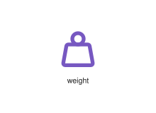
</div>
</div>

{{#endtab}}
{{#tab name="Code"}}

```xml
{{#include ../samples/icons/Tabler-Icons/weight-5b6b323b.xal}}
```

{{#endtab}}
{{#endtabs}}

<div class="xal-ref-tag"><code>&lt;item id=&#34;104865&#34; /&gt;</code></div>

</div>
<div class="xal-ref-card">
<div class="xal-ref-title">wheat-off</div>

{{#tabs name="svg-ref-4866"}}
{{#tab name="Preview"}}
<div class="xal-ref-preview">
<div>
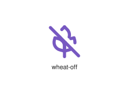
</div>
</div>

{{#endtab}}
{{#tab name="Code"}}

```xml
{{#include ../samples/icons/Tabler-Icons/wheat-off-b2c6142d.xal}}
```

{{#endtab}}
{{#endtabs}}

<div class="xal-ref-tag"><code>&lt;item id=&#34;104867&#34; /&gt;</code></div>

</div>
<div class="xal-ref-card">
<div class="xal-ref-title">wheat</div>

{{#tabs name="svg-ref-4867"}}
{{#tab name="Preview"}}
<div class="xal-ref-preview">
<div>
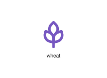
</div>
</div>

{{#endtab}}
{{#tab name="Code"}}

```xml
{{#include ../samples/icons/Tabler-Icons/wheat-42093657.xal}}
```

{{#endtab}}
{{#endtabs}}

<div class="xal-ref-tag"><code>&lt;item id=&#34;104866&#34; /&gt;</code></div>

</div>
<div class="xal-ref-card">
<div class="xal-ref-title">wheel</div>

{{#tabs name="svg-ref-4868"}}
{{#tab name="Preview"}}
<div class="xal-ref-preview">
<div>
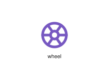
</div>
</div>

{{#endtab}}
{{#tab name="Code"}}

```xml
{{#include ../samples/icons/Tabler-Icons/wheel-8908a802.xal}}
```

{{#endtab}}
{{#endtabs}}

<div class="xal-ref-tag"><code>&lt;item id=&#34;104868&#34; /&gt;</code></div>

</div>
<div class="xal-ref-card">
<div class="xal-ref-title">wheelchair-off</div>

{{#tabs name="svg-ref-4869"}}
{{#tab name="Preview"}}
<div class="xal-ref-preview">
<div>

</div>
</div>

{{#endtab}}
{{#tab name="Code"}}

```xml
{{#include ../samples/icons/Tabler-Icons/wheelchair-off-10c67847.xal}}
```

{{#endtab}}
{{#endtabs}}

<div class="xal-ref-tag"><code>&lt;item id=&#34;104870&#34; /&gt;</code></div>

</div>
<div class="xal-ref-card">
<div class="xal-ref-title">wheelchair</div>

{{#tabs name="svg-ref-4870"}}
{{#tab name="Preview"}}
<div class="xal-ref-preview">
<div>

</div>
</div>

{{#endtab}}
{{#tab name="Code"}}

```xml
{{#include ../samples/icons/Tabler-Icons/wheelchair-79eb7a10.xal}}
```

{{#endtab}}
{{#endtabs}}

<div class="xal-ref-tag"><code>&lt;item id=&#34;104869&#34; /&gt;</code></div>

</div>
<div class="xal-ref-card">
<div class="xal-ref-title">whirl</div>

{{#tabs name="svg-ref-4871"}}
{{#tab name="Preview"}}
<div class="xal-ref-preview">
<div>
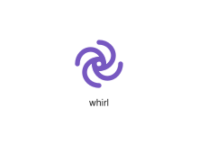
</div>
</div>

{{#endtab}}
{{#tab name="Code"}}

```xml
{{#include ../samples/icons/Tabler-Icons/whirl-507bf055.xal}}
```

{{#endtab}}
{{#endtabs}}

<div class="xal-ref-tag"><code>&lt;item id=&#34;104871&#34; /&gt;</code></div>

</div>
<div class="xal-ref-card">
<div class="xal-ref-title">wifi-0</div>

{{#tabs name="svg-ref-4872"}}
{{#tab name="Preview"}}
<div class="xal-ref-preview">
<div>
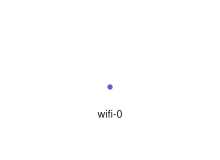
</div>
</div>

{{#endtab}}
{{#tab name="Code"}}

```xml
{{#include ../samples/icons/Tabler-Icons/wifi-0-c6a6cd88.xal}}
```

{{#endtab}}
{{#endtabs}}

<div class="xal-ref-tag"><code>&lt;item id=&#34;104873&#34; /&gt;</code></div>

</div>
<div class="xal-ref-card">
<div class="xal-ref-title">wifi-1</div>

{{#tabs name="svg-ref-4873"}}
{{#tab name="Preview"}}
<div class="xal-ref-preview">
<div>

</div>
</div>

{{#endtab}}
{{#tab name="Code"}}

```xml
{{#include ../samples/icons/Tabler-Icons/wifi-1-fbc6e438.xal}}
```

{{#endtab}}
{{#endtabs}}

<div class="xal-ref-tag"><code>&lt;item id=&#34;104874&#34; /&gt;</code></div>

</div>
<div class="xal-ref-card">
<div class="xal-ref-title">wifi-2</div>

{{#tabs name="svg-ref-4874"}}
{{#tab name="Preview"}}
<div class="xal-ref-preview">
<div>

</div>
</div>

{{#endtab}}
{{#tab name="Code"}}

```xml
{{#include ../samples/icons/Tabler-Icons/wifi-2-bc669ee8.xal}}
```

{{#endtab}}
{{#endtabs}}

<div class="xal-ref-tag"><code>&lt;item id=&#34;104875&#34; /&gt;</code></div>

</div>
<div class="xal-ref-card">
<div class="xal-ref-title">wifi-off</div>

{{#tabs name="svg-ref-4875"}}
{{#tab name="Preview"}}
<div class="xal-ref-preview">
<div>

</div>
</div>

{{#endtab}}
{{#tab name="Code"}}

```xml
{{#include ../samples/icons/Tabler-Icons/wifi-off-76e577d0.xal}}
```

{{#endtab}}
{{#endtabs}}

<div class="xal-ref-tag"><code>&lt;item id=&#34;104876&#34; /&gt;</code></div>

</div>
<div class="xal-ref-card">
<div class="xal-ref-title">wifi</div>

{{#tabs name="svg-ref-4876"}}
{{#tab name="Preview"}}
<div class="xal-ref-preview">
<div>

</div>
</div>

{{#endtab}}
{{#tab name="Code"}}

```xml
{{#include ../samples/icons/Tabler-Icons/wifi-7344ff21.xal}}
```

{{#endtab}}
{{#endtabs}}

<div class="xal-ref-tag"><code>&lt;item id=&#34;104872&#34; /&gt;</code></div>

</div>
<div class="xal-ref-card">
<div class="xal-ref-title">wind-electricity</div>

{{#tabs name="svg-ref-4877"}}
{{#tab name="Preview"}}
<div class="xal-ref-preview">
<div>
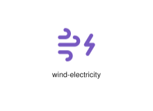
</div>
</div>

{{#endtab}}
{{#tab name="Code"}}

```xml
{{#include ../samples/icons/Tabler-Icons/wind-electricity-a9fa812e.xal}}
```

{{#endtab}}
{{#endtabs}}

<div class="xal-ref-tag"><code>&lt;item id=&#34;104878&#34; /&gt;</code></div>

</div>
<div class="xal-ref-card">
<div class="xal-ref-title">wind-off</div>

{{#tabs name="svg-ref-4878"}}
{{#tab name="Preview"}}
<div class="xal-ref-preview">
<div>
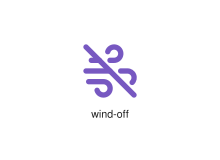
</div>
</div>

{{#endtab}}
{{#tab name="Code"}}

```xml
{{#include ../samples/icons/Tabler-Icons/wind-off-947dd073.xal}}
```

{{#endtab}}
{{#endtabs}}

<div class="xal-ref-tag"><code>&lt;item id=&#34;104879&#34; /&gt;</code></div>

</div>
<div class="xal-ref-card">
<div class="xal-ref-title">wind</div>

{{#tabs name="svg-ref-4879"}}
{{#tab name="Preview"}}
<div class="xal-ref-preview">
<div>
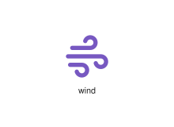
</div>
</div>

{{#endtab}}
{{#tab name="Code"}}

```xml
{{#include ../samples/icons/Tabler-Icons/wind-6787b9fd.xal}}
```

{{#endtab}}
{{#endtabs}}

<div class="xal-ref-tag"><code>&lt;item id=&#34;104877&#34; /&gt;</code></div>

</div>
<div class="xal-ref-card">
<div class="xal-ref-title">windmill-off</div>

{{#tabs name="svg-ref-4880"}}
{{#tab name="Preview"}}
<div class="xal-ref-preview">
<div>

</div>
</div>

{{#endtab}}
{{#tab name="Code"}}

```xml
{{#include ../samples/icons/Tabler-Icons/windmill-off-4ec02ca1.xal}}
```

{{#endtab}}
{{#endtabs}}

<div class="xal-ref-tag"><code>&lt;item id=&#34;104881&#34; /&gt;</code></div>

</div>
<div class="xal-ref-card">
<div class="xal-ref-title">windmill</div>

{{#tabs name="svg-ref-4881"}}
{{#tab name="Preview"}}
<div class="xal-ref-preview">
<div>

</div>
</div>

{{#endtab}}
{{#tab name="Code"}}

```xml
{{#include ../samples/icons/Tabler-Icons/windmill-351b1c63.xal}}
```

{{#endtab}}
{{#endtabs}}

<div class="xal-ref-tag"><code>&lt;item id=&#34;104880&#34; /&gt;</code></div>

</div>
<div class="xal-ref-card">
<div class="xal-ref-title">window-maximize</div>

{{#tabs name="svg-ref-4882"}}
{{#tab name="Preview"}}
<div class="xal-ref-preview">
<div>
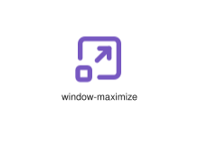
</div>
</div>

{{#endtab}}
{{#tab name="Code"}}

```xml
{{#include ../samples/icons/Tabler-Icons/window-maximize-7bb7454f.xal}}
```

{{#endtab}}
{{#endtabs}}

<div class="xal-ref-tag"><code>&lt;item id=&#34;104883&#34; /&gt;</code></div>

</div>
<div class="xal-ref-card">
<div class="xal-ref-title">window-minimize</div>

{{#tabs name="svg-ref-4883"}}
{{#tab name="Preview"}}
<div class="xal-ref-preview">
<div>

</div>
</div>

{{#endtab}}
{{#tab name="Code"}}

```xml
{{#include ../samples/icons/Tabler-Icons/window-minimize-ebc455a5.xal}}
```

{{#endtab}}
{{#endtabs}}

<div class="xal-ref-tag"><code>&lt;item id=&#34;104884&#34; /&gt;</code></div>

</div>
<div class="xal-ref-card">
<div class="xal-ref-title">window-off</div>

{{#tabs name="svg-ref-4884"}}
{{#tab name="Preview"}}
<div class="xal-ref-preview">
<div>

</div>
</div>

{{#endtab}}
{{#tab name="Code"}}

```xml
{{#include ../samples/icons/Tabler-Icons/window-off-5b0e4466.xal}}
```

{{#endtab}}
{{#endtabs}}

<div class="xal-ref-tag"><code>&lt;item id=&#34;104885&#34; /&gt;</code></div>

</div>
<div class="xal-ref-card">
<div class="xal-ref-title">window</div>

{{#tabs name="svg-ref-4885"}}
{{#tab name="Preview"}}
<div class="xal-ref-preview">
<div>
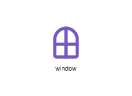
</div>
</div>

{{#endtab}}
{{#tab name="Code"}}

```xml
{{#include ../samples/icons/Tabler-Icons/window-dcd798c3.xal}}
```

{{#endtab}}
{{#endtabs}}

<div class="xal-ref-tag"><code>&lt;item id=&#34;104882&#34; /&gt;</code></div>

</div>
<div class="xal-ref-card">
<div class="xal-ref-title">windsock</div>

{{#tabs name="svg-ref-4886"}}
{{#tab name="Preview"}}
<div class="xal-ref-preview">
<div>
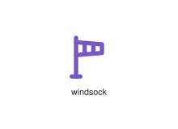
</div>
</div>

{{#endtab}}
{{#tab name="Code"}}

```xml
{{#include ../samples/icons/Tabler-Icons/windsock-7c8c6485.xal}}
```

{{#endtab}}
{{#endtabs}}

<div class="xal-ref-tag"><code>&lt;item id=&#34;104886&#34; /&gt;</code></div>

</div>
<div class="xal-ref-card">
<div class="xal-ref-title">wiper-wash</div>

{{#tabs name="svg-ref-4887"}}
{{#tab name="Preview"}}
<div class="xal-ref-preview">
<div>
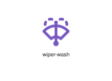
</div>
</div>

{{#endtab}}
{{#tab name="Code"}}

```xml
{{#include ../samples/icons/Tabler-Icons/wiper-wash-3277ddee.xal}}
```

{{#endtab}}
{{#endtabs}}

<div class="xal-ref-tag"><code>&lt;item id=&#34;104888&#34; /&gt;</code></div>

</div>
<div class="xal-ref-card">
<div class="xal-ref-title">wiper</div>

{{#tabs name="svg-ref-4888"}}
{{#tab name="Preview"}}
<div class="xal-ref-preview">
<div>
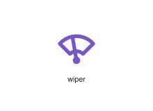
</div>
</div>

{{#endtab}}
{{#tab name="Code"}}

```xml
{{#include ../samples/icons/Tabler-Icons/wiper-af943216.xal}}
```

{{#endtab}}
{{#endtabs}}

<div class="xal-ref-tag"><code>&lt;item id=&#34;104887&#34; /&gt;</code></div>

</div>
<div class="xal-ref-card">
<div class="xal-ref-title">woman</div>

{{#tabs name="svg-ref-4889"}}
{{#tab name="Preview"}}
<div class="xal-ref-preview">
<div>
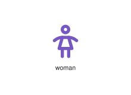
</div>
</div>

{{#endtab}}
{{#tab name="Code"}}

```xml
{{#include ../samples/icons/Tabler-Icons/woman-5173fe0a.xal}}
```

{{#endtab}}
{{#endtabs}}

<div class="xal-ref-tag"><code>&lt;item id=&#34;104889&#34; /&gt;</code></div>

</div>
<div class="xal-ref-card">
<div class="xal-ref-title">wood</div>

{{#tabs name="svg-ref-4890"}}
{{#tab name="Preview"}}
<div class="xal-ref-preview">
<div>
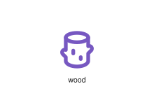
</div>
</div>

{{#endtab}}
{{#tab name="Code"}}

```xml
{{#include ../samples/icons/Tabler-Icons/wood-cf0b5f62.xal}}
```

{{#endtab}}
{{#endtabs}}

<div class="xal-ref-tag"><code>&lt;item id=&#34;104890&#34; /&gt;</code></div>

</div>
<div class="xal-ref-card">
<div class="xal-ref-title">world-bolt</div>

{{#tabs name="svg-ref-4891"}}
{{#tab name="Preview"}}
<div class="xal-ref-preview">
<div>
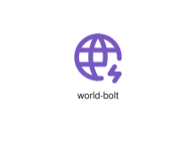
</div>
</div>

{{#endtab}}
{{#tab name="Code"}}

```xml
{{#include ../samples/icons/Tabler-Icons/world-bolt-1ca0dd59.xal}}
```

{{#endtab}}
{{#endtabs}}

<div class="xal-ref-tag"><code>&lt;item id=&#34;104892&#34; /&gt;</code></div>

</div>
<div class="xal-ref-card">
<div class="xal-ref-title">world-cancel</div>

{{#tabs name="svg-ref-4892"}}
{{#tab name="Preview"}}
<div class="xal-ref-preview">
<div>

</div>
</div>

{{#endtab}}
{{#tab name="Code"}}

```xml
{{#include ../samples/icons/Tabler-Icons/world-cancel-2d94af2c.xal}}
```

{{#endtab}}
{{#endtabs}}

<div class="xal-ref-tag"><code>&lt;item id=&#34;104893&#34; /&gt;</code></div>

</div>
<div class="xal-ref-card">
<div class="xal-ref-title">world-check</div>

{{#tabs name="svg-ref-4893"}}
{{#tab name="Preview"}}
<div class="xal-ref-preview">
<div>

</div>
</div>

{{#endtab}}
{{#tab name="Code"}}

```xml
{{#include ../samples/icons/Tabler-Icons/world-check-79ecd9ec.xal}}
```

{{#endtab}}
{{#endtabs}}

<div class="xal-ref-tag"><code>&lt;item id=&#34;104894&#34; /&gt;</code></div>

</div>
<div class="xal-ref-card">
<div class="xal-ref-title">world-code</div>

{{#tabs name="svg-ref-4894"}}
{{#tab name="Preview"}}
<div class="xal-ref-preview">
<div>

</div>
</div>

{{#endtab}}
{{#tab name="Code"}}

```xml
{{#include ../samples/icons/Tabler-Icons/world-code-61d9e198.xal}}
```

{{#endtab}}
{{#endtabs}}

<div class="xal-ref-tag"><code>&lt;item id=&#34;104895&#34; /&gt;</code></div>

</div>
<div class="xal-ref-card">
<div class="xal-ref-title">world-cog</div>

{{#tabs name="svg-ref-4895"}}
{{#tab name="Preview"}}
<div class="xal-ref-preview">
<div>

</div>
</div>

{{#endtab}}
{{#tab name="Code"}}

```xml
{{#include ../samples/icons/Tabler-Icons/world-cog-c562f727.xal}}
```

{{#endtab}}
{{#endtabs}}

<div class="xal-ref-tag"><code>&lt;item id=&#34;104896&#34; /&gt;</code></div>

</div>
<div class="xal-ref-card">
<div class="xal-ref-title">world-dollar</div>

{{#tabs name="svg-ref-4896"}}
{{#tab name="Preview"}}
<div class="xal-ref-preview">
<div>

</div>
</div>

{{#endtab}}
{{#tab name="Code"}}

```xml
{{#include ../samples/icons/Tabler-Icons/world-dollar-f7a673a6.xal}}
```

{{#endtab}}
{{#endtabs}}

<div class="xal-ref-tag"><code>&lt;item id=&#34;104897&#34; /&gt;</code></div>

</div>
<div class="xal-ref-card">
<div class="xal-ref-title">world-down</div>

{{#tabs name="svg-ref-4897"}}
{{#tab name="Preview"}}
<div class="xal-ref-preview">
<div>
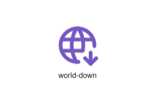
</div>
</div>

{{#endtab}}
{{#tab name="Code"}}

```xml
{{#include ../samples/icons/Tabler-Icons/world-down-998ea9a5.xal}}
```

{{#endtab}}
{{#endtabs}}

<div class="xal-ref-tag"><code>&lt;item id=&#34;104898&#34; /&gt;</code></div>

</div>
<div class="xal-ref-card">
<div class="xal-ref-title">world-download</div>

{{#tabs name="svg-ref-4898"}}
{{#tab name="Preview"}}
<div class="xal-ref-preview">
<div>

</div>
</div>

{{#endtab}}
{{#tab name="Code"}}

```xml
{{#include ../samples/icons/Tabler-Icons/world-download-8fd791b7.xal}}
```

{{#endtab}}
{{#endtabs}}

<div class="xal-ref-tag"><code>&lt;item id=&#34;104899&#34; /&gt;</code></div>

</div>
<div class="xal-ref-card">
<div class="xal-ref-title">world-exclamation</div>

{{#tabs name="svg-ref-4899"}}
{{#tab name="Preview"}}
<div class="xal-ref-preview">
<div>

</div>
</div>

{{#endtab}}
{{#tab name="Code"}}

```xml
{{#include ../samples/icons/Tabler-Icons/world-exclamation-6156c0c3.xal}}
```

{{#endtab}}
{{#endtabs}}

<div class="xal-ref-tag"><code>&lt;item id=&#34;104900&#34; /&gt;</code></div>

</div>
<div class="xal-ref-card">
<div class="xal-ref-title">world-heart</div>

{{#tabs name="svg-ref-4900"}}
{{#tab name="Preview"}}
<div class="xal-ref-preview">
<div>

</div>
</div>

{{#endtab}}
{{#tab name="Code"}}

```xml
{{#include ../samples/icons/Tabler-Icons/world-heart-bec9a79e.xal}}
```

{{#endtab}}
{{#endtabs}}

<div class="xal-ref-tag"><code>&lt;item id=&#34;104901&#34; /&gt;</code></div>

</div>
<div class="xal-ref-card">
<div class="xal-ref-title">world-latitude</div>

{{#tabs name="svg-ref-4901"}}
{{#tab name="Preview"}}
<div class="xal-ref-preview">
<div>

</div>
</div>

{{#endtab}}
{{#tab name="Code"}}

```xml
{{#include ../samples/icons/Tabler-Icons/world-latitude-55a64b98.xal}}
```

{{#endtab}}
{{#endtabs}}

<div class="xal-ref-tag"><code>&lt;item id=&#34;104902&#34; /&gt;</code></div>

</div>
<div class="xal-ref-card">
<div class="xal-ref-title">world-longitude</div>

{{#tabs name="svg-ref-4902"}}
{{#tab name="Preview"}}
<div class="xal-ref-preview">
<div>

</div>
</div>

{{#endtab}}
{{#tab name="Code"}}

```xml
{{#include ../samples/icons/Tabler-Icons/world-longitude-9c726712.xal}}
```

{{#endtab}}
{{#endtabs}}

<div class="xal-ref-tag"><code>&lt;item id=&#34;104903&#34; /&gt;</code></div>

</div>
<div class="xal-ref-card">
<div class="xal-ref-title">world-minus</div>

{{#tabs name="svg-ref-4903"}}
{{#tab name="Preview"}}
<div class="xal-ref-preview">
<div>

</div>
</div>

{{#endtab}}
{{#tab name="Code"}}

```xml
{{#include ../samples/icons/Tabler-Icons/world-minus-fa9c6bdf.xal}}
```

{{#endtab}}
{{#endtabs}}

<div class="xal-ref-tag"><code>&lt;item id=&#34;104904&#34; /&gt;</code></div>

</div>
<div class="xal-ref-card">
<div class="xal-ref-title">world-off</div>

{{#tabs name="svg-ref-4904"}}
{{#tab name="Preview"}}
<div class="xal-ref-preview">
<div>
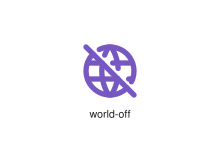
</div>
</div>

{{#endtab}}
{{#tab name="Code"}}

```xml
{{#include ../samples/icons/Tabler-Icons/world-off-18ade52b.xal}}
```

{{#endtab}}
{{#endtabs}}

<div class="xal-ref-tag"><code>&lt;item id=&#34;104905&#34; /&gt;</code></div>

</div>
<div class="xal-ref-card">
<div class="xal-ref-title">world-pause</div>

{{#tabs name="svg-ref-4905"}}
{{#tab name="Preview"}}
<div class="xal-ref-preview">
<div>

</div>
</div>

{{#endtab}}
{{#tab name="Code"}}

```xml
{{#include ../samples/icons/Tabler-Icons/world-pause-28d69c47.xal}}
```

{{#endtab}}
{{#endtabs}}

<div class="xal-ref-tag"><code>&lt;item id=&#34;104906&#34; /&gt;</code></div>

</div>
<div class="xal-ref-card">
<div class="xal-ref-title">world-pin</div>

{{#tabs name="svg-ref-4906"}}
{{#tab name="Preview"}}
<div class="xal-ref-preview">
<div>

</div>
</div>

{{#endtab}}
{{#tab name="Code"}}

```xml
{{#include ../samples/icons/Tabler-Icons/world-pin-481df018.xal}}
```

{{#endtab}}
{{#endtabs}}

<div class="xal-ref-tag"><code>&lt;item id=&#34;104907&#34; /&gt;</code></div>

</div>
<div class="xal-ref-card">
<div class="xal-ref-title">world-plus</div>

{{#tabs name="svg-ref-4907"}}
{{#tab name="Preview"}}
<div class="xal-ref-preview">
<div>

</div>
</div>

{{#endtab}}
{{#tab name="Code"}}

```xml
{{#include ../samples/icons/Tabler-Icons/world-plus-852f7ed1.xal}}
```

{{#endtab}}
{{#endtabs}}

<div class="xal-ref-tag"><code>&lt;item id=&#34;104908&#34; /&gt;</code></div>

</div>
<div class="xal-ref-card">
<div class="xal-ref-title">world-question</div>

{{#tabs name="svg-ref-4908"}}
{{#tab name="Preview"}}
<div class="xal-ref-preview">
<div>

</div>
</div>

{{#endtab}}
{{#tab name="Code"}}

```xml
{{#include ../samples/icons/Tabler-Icons/world-question-95d50592.xal}}
```

{{#endtab}}
{{#endtabs}}

<div class="xal-ref-tag"><code>&lt;item id=&#34;104909&#34; /&gt;</code></div>

</div>
<div class="xal-ref-card">
<div class="xal-ref-title">world-search</div>

{{#tabs name="svg-ref-4909"}}
{{#tab name="Preview"}}
<div class="xal-ref-preview">
<div>

</div>
</div>

{{#endtab}}
{{#tab name="Code"}}

```xml
{{#include ../samples/icons/Tabler-Icons/world-search-6c86bfc3.xal}}
```

{{#endtab}}
{{#endtabs}}

<div class="xal-ref-tag"><code>&lt;item id=&#34;104910&#34; /&gt;</code></div>

</div>
<div class="xal-ref-card">
<div class="xal-ref-title">world-share</div>

{{#tabs name="svg-ref-4910"}}
{{#tab name="Preview"}}
<div class="xal-ref-preview">
<div>

</div>
</div>

{{#endtab}}
{{#tab name="Code"}}

```xml
{{#include ../samples/icons/Tabler-Icons/world-share-56d9d0d1.xal}}
```

{{#endtab}}
{{#endtabs}}

<div class="xal-ref-tag"><code>&lt;item id=&#34;104911&#34; /&gt;</code></div>

</div>
<div class="xal-ref-card">
<div class="xal-ref-title">world-star</div>

{{#tabs name="svg-ref-4911"}}
{{#tab name="Preview"}}
<div class="xal-ref-preview">
<div>

</div>
</div>

{{#endtab}}
{{#tab name="Code"}}

```xml
{{#include ../samples/icons/Tabler-Icons/world-star-fab6c2a6.xal}}
```

{{#endtab}}
{{#endtabs}}

<div class="xal-ref-tag"><code>&lt;item id=&#34;104912&#34; /&gt;</code></div>

</div>
<div class="xal-ref-card">
<div class="xal-ref-title">world-up</div>

{{#tabs name="svg-ref-4912"}}
{{#tab name="Preview"}}
<div class="xal-ref-preview">
<div>

</div>
</div>

{{#endtab}}
{{#tab name="Code"}}

```xml
{{#include ../samples/icons/Tabler-Icons/world-up-752676cf.xal}}
```

{{#endtab}}
{{#endtabs}}

<div class="xal-ref-tag"><code>&lt;item id=&#34;104913&#34; /&gt;</code></div>

</div>
<div class="xal-ref-card">
<div class="xal-ref-title">world-upload</div>

{{#tabs name="svg-ref-4913"}}
{{#tab name="Preview"}}
<div class="xal-ref-preview">
<div>

</div>
</div>

{{#endtab}}
{{#tab name="Code"}}

```xml
{{#include ../samples/icons/Tabler-Icons/world-upload-92fb6c6f.xal}}
```

{{#endtab}}
{{#endtabs}}

<div class="xal-ref-tag"><code>&lt;item id=&#34;104914&#34; /&gt;</code></div>

</div>
<div class="xal-ref-card">
<div class="xal-ref-title">world-www</div>

{{#tabs name="svg-ref-4914"}}
{{#tab name="Preview"}}
<div class="xal-ref-preview">
<div>

</div>
</div>

{{#endtab}}
{{#tab name="Code"}}

```xml
{{#include ../samples/icons/Tabler-Icons/world-www-d996588e.xal}}
```

{{#endtab}}
{{#endtabs}}

<div class="xal-ref-tag"><code>&lt;item id=&#34;104915&#34; /&gt;</code></div>

</div>
<div class="xal-ref-card">
<div class="xal-ref-title">world-x</div>

{{#tabs name="svg-ref-4915"}}
{{#tab name="Preview"}}
<div class="xal-ref-preview">
<div>

</div>
</div>

{{#endtab}}
{{#tab name="Code"}}

```xml
{{#include ../samples/icons/Tabler-Icons/world-x-e35ef6f7.xal}}
```

{{#endtab}}
{{#endtabs}}

<div class="xal-ref-tag"><code>&lt;item id=&#34;104916&#34; /&gt;</code></div>

</div>
<div class="xal-ref-card">
<div class="xal-ref-title">world</div>

{{#tabs name="svg-ref-4916"}}
{{#tab name="Preview"}}
<div class="xal-ref-preview">
<div>
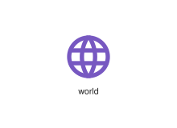
</div>
</div>

{{#endtab}}
{{#tab name="Code"}}

```xml
{{#include ../samples/icons/Tabler-Icons/world-36cb1952.xal}}
```

{{#endtab}}
{{#endtabs}}

<div class="xal-ref-tag"><code>&lt;item id=&#34;104891&#34; /&gt;</code></div>

</div>
<div class="xal-ref-card">
<div class="xal-ref-title">wrecking-ball</div>

{{#tabs name="svg-ref-4917"}}
{{#tab name="Preview"}}
<div class="xal-ref-preview">
<div>
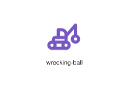
</div>
</div>

{{#endtab}}
{{#tab name="Code"}}

```xml
{{#include ../samples/icons/Tabler-Icons/wrecking-ball-1698f946.xal}}
```

{{#endtab}}
{{#endtabs}}

<div class="xal-ref-tag"><code>&lt;item id=&#34;104917&#34; /&gt;</code></div>

</div>
<div class="xal-ref-card">
<div class="xal-ref-title">writing-off</div>

{{#tabs name="svg-ref-4918"}}
{{#tab name="Preview"}}
<div class="xal-ref-preview">
<div>
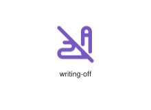
</div>
</div>

{{#endtab}}
{{#tab name="Code"}}

```xml
{{#include ../samples/icons/Tabler-Icons/writing-off-7fdb71cd.xal}}
```

{{#endtab}}
{{#endtabs}}

<div class="xal-ref-tag"><code>&lt;item id=&#34;104919&#34; /&gt;</code></div>

</div>
<div class="xal-ref-card">
<div class="xal-ref-title">writing-sign-off</div>

{{#tabs name="svg-ref-4919"}}
{{#tab name="Preview"}}
<div class="xal-ref-preview">
<div>
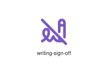
</div>
</div>

{{#endtab}}
{{#tab name="Code"}}

```xml
{{#include ../samples/icons/Tabler-Icons/writing-sign-off-55c8d2ca.xal}}
```

{{#endtab}}
{{#endtabs}}

<div class="xal-ref-tag"><code>&lt;item id=&#34;104921&#34; /&gt;</code></div>

</div>
<div class="xal-ref-card">
<div class="xal-ref-title">writing-sign</div>

{{#tabs name="svg-ref-4920"}}
{{#tab name="Preview"}}
<div class="xal-ref-preview">
<div>
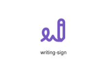
</div>
</div>

{{#endtab}}
{{#tab name="Code"}}

```xml
{{#include ../samples/icons/Tabler-Icons/writing-sign-c6f897ef.xal}}
```

{{#endtab}}
{{#endtabs}}

<div class="xal-ref-tag"><code>&lt;item id=&#34;104920&#34; /&gt;</code></div>

</div>
<div class="xal-ref-card">
<div class="xal-ref-title">writing</div>

{{#tabs name="svg-ref-4921"}}
{{#tab name="Preview"}}
<div class="xal-ref-preview">
<div>
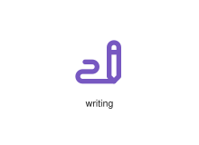
</div>
</div>

{{#endtab}}
{{#tab name="Code"}}

```xml
{{#include ../samples/icons/Tabler-Icons/writing-ba6e13cc.xal}}
```

{{#endtab}}
{{#endtabs}}

<div class="xal-ref-tag"><code>&lt;item id=&#34;104918&#34; /&gt;</code></div>

</div>
<div class="xal-ref-card">
<div class="xal-ref-title">x-power-y</div>

{{#tabs name="svg-ref-4922"}}
{{#tab name="Preview"}}
<div class="xal-ref-preview">
<div>
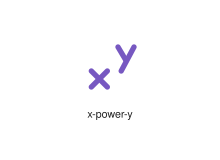
</div>
</div>

{{#endtab}}
{{#tab name="Code"}}

```xml
{{#include ../samples/icons/Tabler-Icons/x-power-y-becdbbad.xal}}
```

{{#endtab}}
{{#endtabs}}

<div class="xal-ref-tag"><code>&lt;item id=&#34;104923&#34; /&gt;</code></div>

</div>
<div class="xal-ref-card">
<div class="xal-ref-title">x</div>

{{#tabs name="svg-ref-4923"}}
{{#tab name="Preview"}}
<div class="xal-ref-preview">
<div>
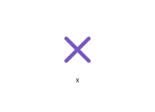
</div>
</div>

{{#endtab}}
{{#tab name="Code"}}

```xml
{{#include ../samples/icons/Tabler-Icons/x-ec894449.xal}}
```

{{#endtab}}
{{#endtabs}}

<div class="xal-ref-tag"><code>&lt;item id=&#34;104922&#34; /&gt;</code></div>

</div>
<div class="xal-ref-card">
<div class="xal-ref-title">xbox-a</div>

{{#tabs name="svg-ref-4924"}}
{{#tab name="Preview"}}
<div class="xal-ref-preview">
<div>
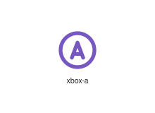
</div>
</div>

{{#endtab}}
{{#tab name="Code"}}

```xml
{{#include ../samples/icons/Tabler-Icons/xbox-a-6e6d62f2.xal}}
```

{{#endtab}}
{{#endtabs}}

<div class="xal-ref-tag"><code>&lt;item id=&#34;104924&#34; /&gt;</code></div>

</div>
<div class="xal-ref-card">
<div class="xal-ref-title">xbox-b</div>

{{#tabs name="svg-ref-4925"}}
{{#tab name="Preview"}}
<div class="xal-ref-preview">
<div>
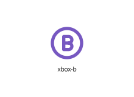
</div>
</div>

{{#endtab}}
{{#tab name="Code"}}

```xml
{{#include ../samples/icons/Tabler-Icons/xbox-b-29cd1822.xal}}
```

{{#endtab}}
{{#endtabs}}

<div class="xal-ref-tag"><code>&lt;item id=&#34;104925&#34; /&gt;</code></div>

</div>
<div class="xal-ref-card">
<div class="xal-ref-title">xbox-x</div>

{{#tabs name="svg-ref-4926"}}
{{#tab name="Preview"}}
<div class="xal-ref-preview">
<div>
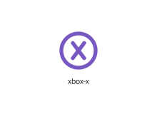
</div>
</div>

{{#endtab}}
{{#tab name="Code"}}

```xml
{{#include ../samples/icons/Tabler-Icons/xbox-x-039d9701.xal}}
```

{{#endtab}}
{{#endtabs}}

<div class="xal-ref-tag"><code>&lt;item id=&#34;104926&#34; /&gt;</code></div>

</div>
<div class="xal-ref-card">
<div class="xal-ref-title">xbox-y</div>

{{#tabs name="svg-ref-4927"}}
{{#tab name="Preview"}}
<div class="xal-ref-preview">
<div>
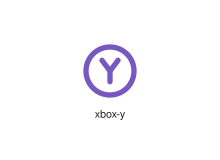
</div>
</div>

{{#endtab}}
{{#tab name="Code"}}

```xml
{{#include ../samples/icons/Tabler-Icons/xbox-y-3efdbeb1.xal}}
```

{{#endtab}}
{{#endtabs}}

<div class="xal-ref-tag"><code>&lt;item id=&#34;104927&#34; /&gt;</code></div>

</div>
<div class="xal-ref-card">
<div class="xal-ref-title">xd</div>

{{#tabs name="svg-ref-4928"}}
{{#tab name="Preview"}}
<div class="xal-ref-preview">
<div>
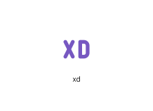
</div>
</div>

{{#endtab}}
{{#tab name="Code"}}

```xml
{{#include ../samples/icons/Tabler-Icons/xd-700e1d6a.xal}}
```

{{#endtab}}
{{#endtabs}}

<div class="xal-ref-tag"><code>&lt;item id=&#34;104928&#34; /&gt;</code></div>

</div>
<div class="xal-ref-card">
<div class="xal-ref-title">xxx</div>

{{#tabs name="svg-ref-4929"}}
{{#tab name="Preview"}}
<div class="xal-ref-preview">
<div>
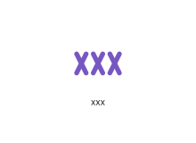
</div>
</div>

{{#endtab}}
{{#tab name="Code"}}

```xml
{{#include ../samples/icons/Tabler-Icons/xxx-03f15322.xal}}
```

{{#endtab}}
{{#endtabs}}

<div class="xal-ref-tag"><code>&lt;item id=&#34;104929&#34; /&gt;</code></div>

</div>
<div class="xal-ref-card">
<div class="xal-ref-title">yin-yang</div>

{{#tabs name="svg-ref-4930"}}
{{#tab name="Preview"}}
<div class="xal-ref-preview">
<div>

</div>
</div>

{{#endtab}}
{{#tab name="Code"}}

```xml
{{#include ../samples/icons/Tabler-Icons/yin-yang-5f1d9b8d.xal}}
```

{{#endtab}}
{{#endtabs}}

<div class="xal-ref-tag"><code>&lt;item id=&#34;104930&#34; /&gt;</code></div>

</div>
<div class="xal-ref-card">
<div class="xal-ref-title">yoga</div>

{{#tabs name="svg-ref-4931"}}
{{#tab name="Preview"}}
<div class="xal-ref-preview">
<div>

</div>
</div>

{{#endtab}}
{{#tab name="Code"}}

```xml
{{#include ../samples/icons/Tabler-Icons/yoga-fe32404d.xal}}
```

{{#endtab}}
{{#endtabs}}

<div class="xal-ref-tag"><code>&lt;item id=&#34;104931&#34; /&gt;</code></div>

</div>
<div class="xal-ref-card">
<div class="xal-ref-title">zeppelin-off</div>

{{#tabs name="svg-ref-4932"}}
{{#tab name="Preview"}}
<div class="xal-ref-preview">
<div>
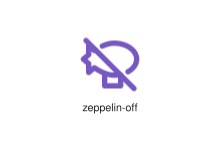
</div>
</div>

{{#endtab}}
{{#tab name="Code"}}

```xml
{{#include ../samples/icons/Tabler-Icons/zeppelin-off-646c5bc2.xal}}
```

{{#endtab}}
{{#endtabs}}

<div class="xal-ref-tag"><code>&lt;item id=&#34;104933&#34; /&gt;</code></div>

</div>
<div class="xal-ref-card">
<div class="xal-ref-title">zeppelin</div>

{{#tabs name="svg-ref-4933"}}
{{#tab name="Preview"}}
<div class="xal-ref-preview">
<div>
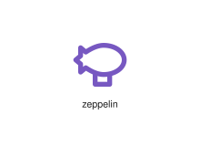
</div>
</div>

{{#endtab}}
{{#tab name="Code"}}

```xml
{{#include ../samples/icons/Tabler-Icons/zeppelin-c235dbad.xal}}
```

{{#endtab}}
{{#endtabs}}

<div class="xal-ref-tag"><code>&lt;item id=&#34;104932&#34; /&gt;</code></div>

</div>
<div class="xal-ref-card">
<div class="xal-ref-title">zip</div>

{{#tabs name="svg-ref-4934"}}
{{#tab name="Preview"}}
<div class="xal-ref-preview">
<div>
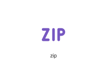
</div>
</div>

{{#endtab}}
{{#tab name="Code"}}

```xml
{{#include ../samples/icons/Tabler-Icons/zip-6c94d8f4.xal}}
```

{{#endtab}}
{{#endtabs}}

<div class="xal-ref-tag"><code>&lt;item id=&#34;104934&#34; /&gt;</code></div>

</div>
<div class="xal-ref-card">
<div class="xal-ref-title">zodiac-aquarius</div>

{{#tabs name="svg-ref-4935"}}
{{#tab name="Preview"}}
<div class="xal-ref-preview">
<div>
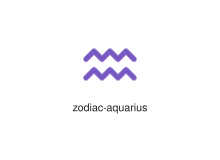
</div>
</div>

{{#endtab}}
{{#tab name="Code"}}

```xml
{{#include ../samples/icons/Tabler-Icons/zodiac-aquarius-b55c0c65.xal}}
```

{{#endtab}}
{{#endtabs}}

<div class="xal-ref-tag"><code>&lt;item id=&#34;104935&#34; /&gt;</code></div>

</div>
<div class="xal-ref-card">
<div class="xal-ref-title">zodiac-aries</div>

{{#tabs name="svg-ref-4936"}}
{{#tab name="Preview"}}
<div class="xal-ref-preview">
<div>
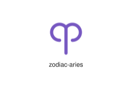
</div>
</div>

{{#endtab}}
{{#tab name="Code"}}

```xml
{{#include ../samples/icons/Tabler-Icons/zodiac-aries-56bb202f.xal}}
```

{{#endtab}}
{{#endtabs}}

<div class="xal-ref-tag"><code>&lt;item id=&#34;104936&#34; /&gt;</code></div>

</div>
<div class="xal-ref-card">
<div class="xal-ref-title">zodiac-cancer</div>

{{#tabs name="svg-ref-4937"}}
{{#tab name="Preview"}}
<div class="xal-ref-preview">
<div>

</div>
</div>

{{#endtab}}
{{#tab name="Code"}}

```xml
{{#include ../samples/icons/Tabler-Icons/zodiac-cancer-16e7fa6d.xal}}
```

{{#endtab}}
{{#endtabs}}

<div class="xal-ref-tag"><code>&lt;item id=&#34;104937&#34; /&gt;</code></div>

</div>
<div class="xal-ref-card">
<div class="xal-ref-title">zodiac-capricorn</div>

{{#tabs name="svg-ref-4938"}}
{{#tab name="Preview"}}
<div class="xal-ref-preview">
<div>

</div>
</div>

{{#endtab}}
{{#tab name="Code"}}

```xml
{{#include ../samples/icons/Tabler-Icons/zodiac-capricorn-6e12a23f.xal}}
```

{{#endtab}}
{{#endtabs}}

<div class="xal-ref-tag"><code>&lt;item id=&#34;104938&#34; /&gt;</code></div>

</div>
<div class="xal-ref-card">
<div class="xal-ref-title">zodiac-gemini</div>

{{#tabs name="svg-ref-4939"}}
{{#tab name="Preview"}}
<div class="xal-ref-preview">
<div>
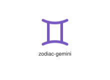
</div>
</div>

{{#endtab}}
{{#tab name="Code"}}

```xml
{{#include ../samples/icons/Tabler-Icons/zodiac-gemini-15e805e6.xal}}
```

{{#endtab}}
{{#endtabs}}

<div class="xal-ref-tag"><code>&lt;item id=&#34;104939&#34; /&gt;</code></div>

</div>
<div class="xal-ref-card">
<div class="xal-ref-title">zodiac-leo</div>

{{#tabs name="svg-ref-4940"}}
{{#tab name="Preview"}}
<div class="xal-ref-preview">
<div>
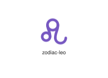
</div>
</div>

{{#endtab}}
{{#tab name="Code"}}

```xml
{{#include ../samples/icons/Tabler-Icons/zodiac-leo-383b670a.xal}}
```

{{#endtab}}
{{#endtabs}}

<div class="xal-ref-tag"><code>&lt;item id=&#34;104940&#34; /&gt;</code></div>

</div>
<div class="xal-ref-card">
<div class="xal-ref-title">zodiac-libra</div>

{{#tabs name="svg-ref-4941"}}
{{#tab name="Preview"}}
<div class="xal-ref-preview">
<div>
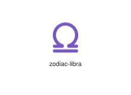
</div>
</div>

{{#endtab}}
{{#tab name="Code"}}

```xml
{{#include ../samples/icons/Tabler-Icons/zodiac-libra-80d1483e.xal}}
```

{{#endtab}}
{{#endtabs}}

<div class="xal-ref-tag"><code>&lt;item id=&#34;104941&#34; /&gt;</code></div>

</div>
<div class="xal-ref-card">
<div class="xal-ref-title">zodiac-pisces</div>

{{#tabs name="svg-ref-4942"}}
{{#tab name="Preview"}}
<div class="xal-ref-preview">
<div>
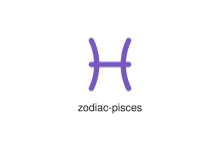
</div>
</div>

{{#endtab}}
{{#tab name="Code"}}

```xml
{{#include ../samples/icons/Tabler-Icons/zodiac-pisces-bb786fd4.xal}}
```

{{#endtab}}
{{#endtabs}}

<div class="xal-ref-tag"><code>&lt;item id=&#34;104942&#34; /&gt;</code></div>

</div>
<div class="xal-ref-card">
<div class="xal-ref-title">zodiac-sagittarius</div>

{{#tabs name="svg-ref-4943"}}
{{#tab name="Preview"}}
<div class="xal-ref-preview">
<div>
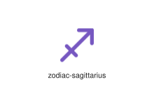
</div>
</div>

{{#endtab}}
{{#tab name="Code"}}

```xml
{{#include ../samples/icons/Tabler-Icons/zodiac-sagittarius-a55aea35.xal}}
```

{{#endtab}}
{{#endtabs}}

<div class="xal-ref-tag"><code>&lt;item id=&#34;104943&#34; /&gt;</code></div>

</div>
<div class="xal-ref-card">
<div class="xal-ref-title">zodiac-scorpio</div>

{{#tabs name="svg-ref-4944"}}
{{#tab name="Preview"}}
<div class="xal-ref-preview">
<div>

</div>
</div>

{{#endtab}}
{{#tab name="Code"}}

```xml
{{#include ../samples/icons/Tabler-Icons/zodiac-scorpio-6ab9d625.xal}}
```

{{#endtab}}
{{#endtabs}}

<div class="xal-ref-tag"><code>&lt;item id=&#34;104944&#34; /&gt;</code></div>

</div>
<div class="xal-ref-card">
<div class="xal-ref-title">zodiac-taurus</div>

{{#tabs name="svg-ref-4945"}}
{{#tab name="Preview"}}
<div class="xal-ref-preview">
<div>
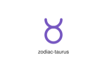
</div>
</div>

{{#endtab}}
{{#tab name="Code"}}

```xml
{{#include ../samples/icons/Tabler-Icons/zodiac-taurus-0d5bf1d0.xal}}
```

{{#endtab}}
{{#endtabs}}

<div class="xal-ref-tag"><code>&lt;item id=&#34;104945&#34; /&gt;</code></div>

</div>
<div class="xal-ref-card">
<div class="xal-ref-title">zodiac-virgo</div>

{{#tabs name="svg-ref-4946"}}
{{#tab name="Preview"}}
<div class="xal-ref-preview">
<div>

</div>
</div>

{{#endtab}}
{{#tab name="Code"}}

```xml
{{#include ../samples/icons/Tabler-Icons/zodiac-virgo-32ca3156.xal}}
```

{{#endtab}}
{{#endtabs}}

<div class="xal-ref-tag"><code>&lt;item id=&#34;104946&#34; /&gt;</code></div>

</div>
<div class="xal-ref-card">
<div class="xal-ref-title">zoom-cancel</div>

{{#tabs name="svg-ref-4947"}}
{{#tab name="Preview"}}
<div class="xal-ref-preview">
<div>
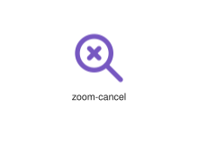
</div>
</div>

{{#endtab}}
{{#tab name="Code"}}

```xml
{{#include ../samples/icons/Tabler-Icons/zoom-cancel-2f2a1a64.xal}}
```

{{#endtab}}
{{#endtabs}}

<div class="xal-ref-tag"><code>&lt;item id=&#34;104948&#34; /&gt;</code></div>

</div>
<div class="xal-ref-card">
<div class="xal-ref-title">zoom-check</div>

{{#tabs name="svg-ref-4948"}}
{{#tab name="Preview"}}
<div class="xal-ref-preview">
<div>

</div>
</div>

{{#endtab}}
{{#tab name="Code"}}

```xml
{{#include ../samples/icons/Tabler-Icons/zoom-check-aaca9b2f.xal}}
```

{{#endtab}}
{{#endtabs}}

<div class="xal-ref-tag"><code>&lt;item id=&#34;104949&#34; /&gt;</code></div>

</div>
<div class="xal-ref-card">
<div class="xal-ref-title">zoom-code</div>

{{#tabs name="svg-ref-4949"}}
{{#tab name="Preview"}}
<div class="xal-ref-preview">
<div>
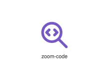
</div>
</div>

{{#endtab}}
{{#tab name="Code"}}

```xml
{{#include ../samples/icons/Tabler-Icons/zoom-code-916fd9ff.xal}}
```

{{#endtab}}
{{#endtabs}}

<div class="xal-ref-tag"><code>&lt;item id=&#34;104950&#34; /&gt;</code></div>

</div>
</div>
