# Yamaha-Network-Icons

This page references SVG files under `etc/resources/aws/svg/Yamaha-Network-Icons`.
Each card shows the SVG preview first and the XAL tag syntax in the Code tab.
Total SVG files: 59.

<style>
.xal-ref-grid{display:grid;grid-template-columns:repeat(auto-fit,minmax(260px,1fr));gap:1rem;margin:1rem 0 1.5rem}.xal-ref-card{border:1px solid var(--table-border-color);border-radius:8px;overflow:hidden;background:var(--bg);padding:.75rem}.xal-ref-preview{min-height:132px;display:flex;align-items:center;justify-content:center}.xal-ref-preview img{max-width:96px;max-height:96px}.xal-ref-path{font-size:.78em;opacity:.75;word-break:break-all;margin-top:.5rem}.xal-ref-card pre{margin:0;max-height:18rem;overflow:auto;white-space:pre-wrap}.xal-ref-card code{font-size:.78em}
</style>

<div class="xal-ref-grid">
<div class="xal-ref-card">

{{#tabs name="svg-ref-0000"}}
{{#tab name="Preview"}}
<div class="xal-ref-preview">
<div>
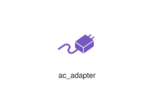
<div class="xal-ref-path">etc/resources/aws/svg/Yamaha-Network-Icons/ac_adapter.svg<br>69817 bytes</div>
</div>
</div>
{{#endtab}}
{{#tab name="Code"}}

```xml
{{#include ../samples/icons/Yamaha-Network-Icons/ac-adapter-00963421.xal}}
```

{{#endtab}}
{{#endtabs}}

</div>
<div class="xal-ref-card">

{{#tabs name="svg-ref-0001"}}
{{#tab name="Preview"}}
<div class="xal-ref-preview">
<div>
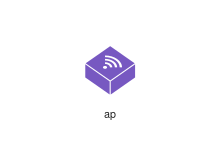
<div class="xal-ref-path">etc/resources/aws/svg/Yamaha-Network-Icons/ap.svg<br>72617 bytes</div>
</div>
</div>
{{#endtab}}
{{#tab name="Code"}}

```xml
{{#include ../samples/icons/Yamaha-Network-Icons/ap-2d3402da.xal}}
```

{{#endtab}}
{{#endtabs}}

</div>
<div class="xal-ref-card">

{{#tabs name="svg-ref-0002"}}
{{#tab name="Preview"}}
<div class="xal-ref-preview">
<div>
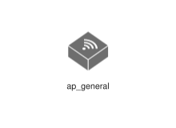
<div class="xal-ref-path">etc/resources/aws/svg/Yamaha-Network-Icons/ap_general.svg<br>69829 bytes</div>
</div>
</div>
{{#endtab}}
{{#tab name="Code"}}

```xml
{{#include ../samples/icons/Yamaha-Network-Icons/ap-general-c25ff119.xal}}
```

{{#endtab}}
{{#endtabs}}

</div>
<div class="xal-ref-card">

{{#tabs name="svg-ref-0003"}}
{{#tab name="Preview"}}
<div class="xal-ref-preview">
<div>

<div class="xal-ref-path">etc/resources/aws/svg/Yamaha-Network-Icons/cracker.svg<br>72617 bytes</div>
</div>
</div>
{{#endtab}}
{{#tab name="Code"}}

```xml
{{#include ../samples/icons/Yamaha-Network-Icons/cracker-f91510e9.xal}}
```

{{#endtab}}
{{#endtabs}}

</div>
<div class="xal-ref-card">

{{#tabs name="svg-ref-0004"}}
{{#tab name="Preview"}}
<div class="xal-ref-preview">
<div>

<div class="xal-ref-path">etc/resources/aws/svg/Yamaha-Network-Icons/desktop_pc.svg<br>72617 bytes</div>
</div>
</div>
{{#endtab}}
{{#tab name="Code"}}

```xml
{{#include ../samples/icons/Yamaha-Network-Icons/desktop-pc-f709516a.xal}}
```

{{#endtab}}
{{#endtabs}}

</div>
<div class="xal-ref-card">

{{#tabs name="svg-ref-0005"}}
{{#tab name="Preview"}}
<div class="xal-ref-preview">
<div>

<div class="xal-ref-path">etc/resources/aws/svg/Yamaha-Network-Icons/desktop_pc_vpn8.svg<br>72617 bytes</div>
</div>
</div>
{{#endtab}}
{{#tab name="Code"}}

```xml
{{#include ../samples/icons/Yamaha-Network-Icons/desktop-pc-vpn8-f462d60b.xal}}
```

{{#endtab}}
{{#endtabs}}

</div>
<div class="xal-ref-card">

{{#tabs name="svg-ref-0006"}}
{{#tab name="Preview"}}
<div class="xal-ref-preview">
<div>
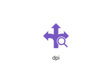
<div class="xal-ref-path">etc/resources/aws/svg/Yamaha-Network-Icons/dpi.svg<br>72592 bytes</div>
</div>
</div>
{{#endtab}}
{{#tab name="Code"}}

```xml
{{#include ../samples/icons/Yamaha-Network-Icons/dpi-b36189c4.xal}}
```

{{#endtab}}
{{#endtabs}}

</div>
<div class="xal-ref-card">

{{#tabs name="svg-ref-0007"}}
{{#tab name="Preview"}}
<div class="xal-ref-preview">
<div>

<div class="xal-ref-path">etc/resources/aws/svg/Yamaha-Network-Icons/firewall_bridge.svg<br>69829 bytes</div>
</div>
</div>
{{#endtab}}
{{#tab name="Code"}}

```xml
{{#include ../samples/icons/Yamaha-Network-Icons/firewall-bridge-f479e407.xal}}
```

{{#endtab}}
{{#endtabs}}

</div>
<div class="xal-ref-card">

{{#tabs name="svg-ref-0008"}}
{{#tab name="Preview"}}
<div class="xal-ref-preview">
<div>

<div class="xal-ref-path">etc/resources/aws/svg/Yamaha-Network-Icons/firewall_router.svg<br>69829 bytes</div>
</div>
</div>
{{#endtab}}
{{#tab name="Code"}}

```xml
{{#include ../samples/icons/Yamaha-Network-Icons/firewall-router-5d9a92fa.xal}}
```

{{#endtab}}
{{#endtabs}}

</div>
<div class="xal-ref-card">

{{#tabs name="svg-ref-0009"}}
{{#tab name="Preview"}}
<div class="xal-ref-preview">
<div>
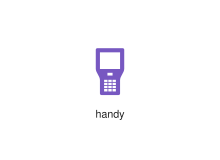
<div class="xal-ref-path">etc/resources/aws/svg/Yamaha-Network-Icons/handy.svg<br>69841 bytes</div>
</div>
</div>
{{#endtab}}
{{#tab name="Code"}}

```xml
{{#include ../samples/icons/Yamaha-Network-Icons/handy-b2ff43be.xal}}
```

{{#endtab}}
{{#endtabs}}

</div>
<div class="xal-ref-card">

{{#tabs name="svg-ref-0010"}}
{{#tab name="Preview"}}
<div class="xal-ref-preview">
<div>

<div class="xal-ref-path">etc/resources/aws/svg/Yamaha-Network-Icons/internet.svg<br>69829 bytes</div>
</div>
</div>
{{#endtab}}
{{#tab name="Code"}}

```xml
{{#include ../samples/icons/Yamaha-Network-Icons/internet-454b74c6.xal}}
```

{{#endtab}}
{{#endtabs}}

</div>
<div class="xal-ref-card">

{{#tabs name="svg-ref-0011"}}
{{#tab name="Preview"}}
<div class="xal-ref-preview">
<div>

<div class="xal-ref-path">etc/resources/aws/svg/Yamaha-Network-Icons/ip_camera.svg<br>69817 bytes</div>
</div>
</div>
{{#endtab}}
{{#tab name="Code"}}

```xml
{{#include ../samples/icons/Yamaha-Network-Icons/ip-camera-455112e7.xal}}
```

{{#endtab}}
{{#endtabs}}

</div>
<div class="xal-ref-card">

{{#tabs name="svg-ref-0012"}}
{{#tab name="Preview"}}
<div class="xal-ref-preview">
<div>

<div class="xal-ref-path">etc/resources/aws/svg/Yamaha-Network-Icons/ip_phone.svg<br>69829 bytes</div>
</div>
</div>
{{#endtab}}
{{#tab name="Code"}}

```xml
{{#include ../samples/icons/Yamaha-Network-Icons/ip-phone-946a0cb4.xal}}
```

{{#endtab}}
{{#endtabs}}

</div>
<div class="xal-ref-card">

{{#tabs name="svg-ref-0013"}}
{{#tab name="Preview"}}
<div class="xal-ref-preview">
<div>
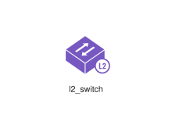
<div class="xal-ref-path">etc/resources/aws/svg/Yamaha-Network-Icons/l2_switch.svg<br>72638 bytes</div>
</div>
</div>
{{#endtab}}
{{#tab name="Code"}}

```xml
{{#include ../samples/icons/Yamaha-Network-Icons/l2-switch-fc2b1847.xal}}
```

{{#endtab}}
{{#endtabs}}

</div>
<div class="xal-ref-card">

{{#tabs name="svg-ref-0014"}}
{{#tab name="Preview"}}
<div class="xal-ref-preview">
<div>
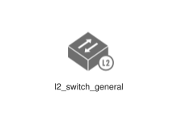
<div class="xal-ref-path">etc/resources/aws/svg/Yamaha-Network-Icons/l2_switch_general.svg<br>69829 bytes</div>
</div>
</div>
{{#endtab}}
{{#tab name="Code"}}

```xml
{{#include ../samples/icons/Yamaha-Network-Icons/l2-switch-general-f361751e.xal}}
```

{{#endtab}}
{{#endtabs}}

</div>
<div class="xal-ref-card">

{{#tabs name="svg-ref-0015"}}
{{#tab name="Preview"}}
<div class="xal-ref-preview">
<div>
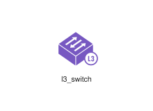
<div class="xal-ref-path">etc/resources/aws/svg/Yamaha-Network-Icons/l3_switch.svg<br>72638 bytes</div>
</div>
</div>
{{#endtab}}
{{#tab name="Code"}}

```xml
{{#include ../samples/icons/Yamaha-Network-Icons/l3-switch-678e5428.xal}}
```

{{#endtab}}
{{#endtabs}}

</div>
<div class="xal-ref-card">

{{#tabs name="svg-ref-0016"}}
{{#tab name="Preview"}}
<div class="xal-ref-preview">
<div>
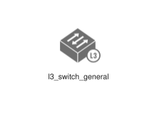
<div class="xal-ref-path">etc/resources/aws/svg/Yamaha-Network-Icons/l3_switch_general.svg<br>69829 bytes</div>
</div>
</div>
{{#endtab}}
{{#tab name="Code"}}

```xml
{{#include ../samples/icons/Yamaha-Network-Icons/l3-switch-general-96064e58.xal}}
```

{{#endtab}}
{{#endtabs}}

</div>
<div class="xal-ref-card">

{{#tabs name="svg-ref-0017"}}
{{#tab name="Preview"}}
<div class="xal-ref-preview">
<div>
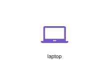
<div class="xal-ref-path">etc/resources/aws/svg/Yamaha-Network-Icons/laptop.svg<br>72629 bytes</div>
</div>
</div>
{{#endtab}}
{{#tab name="Code"}}

```xml
{{#include ../samples/icons/Yamaha-Network-Icons/laptop-1462c3bb.xal}}
```

{{#endtab}}
{{#endtabs}}

</div>
<div class="xal-ref-card">

{{#tabs name="svg-ref-0018"}}
{{#tab name="Preview"}}
<div class="xal-ref-preview">
<div>

<div class="xal-ref-path">etc/resources/aws/svg/Yamaha-Network-Icons/laptop_vpn8.svg<br>72617 bytes</div>
</div>
</div>
{{#endtab}}
{{#tab name="Code"}}

```xml
{{#include ../samples/icons/Yamaha-Network-Icons/laptop-vpn8-666f2d23.xal}}
```

{{#endtab}}
{{#endtabs}}

</div>
<div class="xal-ref-card">

{{#tabs name="svg-ref-0019"}}
{{#tab name="Preview"}}
<div class="xal-ref-preview">
<div>
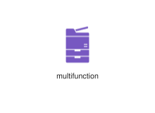
<div class="xal-ref-path">etc/resources/aws/svg/Yamaha-Network-Icons/multifunction.svg<br>72617 bytes</div>
</div>
</div>
{{#endtab}}
{{#tab name="Code"}}

```xml
{{#include ../samples/icons/Yamaha-Network-Icons/multifunction-03c76c3f.xal}}
```

{{#endtab}}
{{#endtabs}}

</div>
<div class="xal-ref-card">

{{#tabs name="svg-ref-0020"}}
{{#tab name="Preview"}}
<div class="xal-ref-preview">
<div>

<div class="xal-ref-path">etc/resources/aws/svg/Yamaha-Network-Icons/network_administrator.svg<br>72617 bytes</div>
</div>
</div>
{{#endtab}}
{{#tab name="Code"}}

```xml
{{#include ../samples/icons/Yamaha-Network-Icons/network-administrator-2bfc001c.xal}}
```

{{#endtab}}
{{#endtabs}}

</div>
<div class="xal-ref-card">

{{#tabs name="svg-ref-0021"}}
{{#tab name="Preview"}}
<div class="xal-ref-preview">
<div>

<div class="xal-ref-path">etc/resources/aws/svg/Yamaha-Network-Icons/network_administrator_w.svg<br>69817 bytes</div>
</div>
</div>
{{#endtab}}
{{#tab name="Code"}}

```xml
{{#include ../samples/icons/Yamaha-Network-Icons/network-administrator-w-2d751a90.xal}}
```

{{#endtab}}
{{#endtabs}}

</div>
<div class="xal-ref-card">

{{#tabs name="svg-ref-0022"}}
{{#tab name="Preview"}}
<div class="xal-ref-preview">
<div>
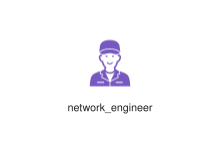
<div class="xal-ref-path">etc/resources/aws/svg/Yamaha-Network-Icons/network_engineer.svg<br>72617 bytes</div>
</div>
</div>
{{#endtab}}
{{#tab name="Code"}}

```xml
{{#include ../samples/icons/Yamaha-Network-Icons/network-engineer-9258e4bc.xal}}
```

{{#endtab}}
{{#endtabs}}

</div>
<div class="xal-ref-card">

{{#tabs name="svg-ref-0023"}}
{{#tab name="Preview"}}
<div class="xal-ref-preview">
<div>
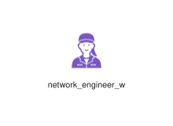
<div class="xal-ref-path">etc/resources/aws/svg/Yamaha-Network-Icons/network_engineer_w.svg<br>69846 bytes</div>
</div>
</div>
{{#endtab}}
{{#tab name="Code"}}

```xml
{{#include ../samples/icons/Yamaha-Network-Icons/network-engineer-w-241539bc.xal}}
```

{{#endtab}}
{{#endtabs}}

</div>
<div class="xal-ref-card">

{{#tabs name="svg-ref-0024"}}
{{#tab name="Preview"}}
<div class="xal-ref-preview">
<div>
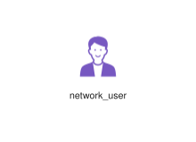
<div class="xal-ref-path">etc/resources/aws/svg/Yamaha-Network-Icons/network_user.svg<br>72617 bytes</div>
</div>
</div>
{{#endtab}}
{{#tab name="Code"}}

```xml
{{#include ../samples/icons/Yamaha-Network-Icons/network-user-7226f58a.xal}}
```

{{#endtab}}
{{#endtabs}}

</div>
<div class="xal-ref-card">

{{#tabs name="svg-ref-0025"}}
{{#tab name="Preview"}}
<div class="xal-ref-preview">
<div>
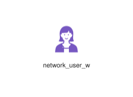
<div class="xal-ref-path">etc/resources/aws/svg/Yamaha-Network-Icons/network_user_w.svg<br>69817 bytes</div>
</div>
</div>
{{#endtab}}
{{#tab name="Code"}}

```xml
{{#include ../samples/icons/Yamaha-Network-Icons/network-user-w-c7b96845.xal}}
```

{{#endtab}}
{{#endtabs}}

</div>
<div class="xal-ref-card">

{{#tabs name="svg-ref-0026"}}
{{#tab name="Preview"}}
<div class="xal-ref-preview">
<div>
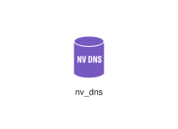
<div class="xal-ref-path">etc/resources/aws/svg/Yamaha-Network-Icons/nv_dns.svg<br>72617 bytes</div>
</div>
</div>
{{#endtab}}
{{#tab name="Code"}}

```xml
{{#include ../samples/icons/Yamaha-Network-Icons/nv-dns-1342797f.xal}}
```

{{#endtab}}
{{#endtabs}}

</div>
<div class="xal-ref-card">

{{#tabs name="svg-ref-0027"}}
{{#tab name="Preview"}}
<div class="xal-ref-preview">
<div>

<div class="xal-ref-path">etc/resources/aws/svg/Yamaha-Network-Icons/officework.svg<br>69817 bytes</div>
</div>
</div>
{{#endtab}}
{{#tab name="Code"}}

```xml
{{#include ../samples/icons/Yamaha-Network-Icons/officework-466e73ea.xal}}
```

{{#endtab}}
{{#endtabs}}

</div>
<div class="xal-ref-card">

{{#tabs name="svg-ref-0028"}}
{{#tab name="Preview"}}
<div class="xal-ref-preview">
<div>
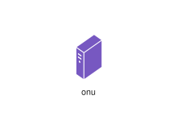
<div class="xal-ref-path">etc/resources/aws/svg/Yamaha-Network-Icons/onu.svg<br>72617 bytes</div>
</div>
</div>
{{#endtab}}
{{#tab name="Code"}}

```xml
{{#include ../samples/icons/Yamaha-Network-Icons/onu-2daac456.xal}}
```

{{#endtab}}
{{#endtabs}}

</div>
<div class="xal-ref-card">

{{#tabs name="svg-ref-0029"}}
{{#tab name="Preview"}}
<div class="xal-ref-preview">
<div>
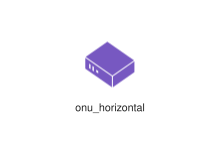
<div class="xal-ref-path">etc/resources/aws/svg/Yamaha-Network-Icons/onu_horizontal.svg<br>69907 bytes</div>
</div>
</div>
{{#endtab}}
{{#tab name="Code"}}

```xml
{{#include ../samples/icons/Yamaha-Network-Icons/onu-horizontal-1fc890aa.xal}}
```

{{#endtab}}
{{#endtabs}}

</div>
<div class="xal-ref-card">

{{#tabs name="svg-ref-0030"}}
{{#tab name="Preview"}}
<div class="xal-ref-preview">
<div>
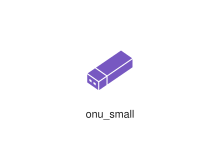
<div class="xal-ref-path">etc/resources/aws/svg/Yamaha-Network-Icons/onu_small.svg<br>72617 bytes</div>
</div>
</div>
{{#endtab}}
{{#tab name="Code"}}

```xml
{{#include ../samples/icons/Yamaha-Network-Icons/onu-small-a154af83.xal}}
```

{{#endtab}}
{{#endtabs}}

</div>
<div class="xal-ref-card">

{{#tabs name="svg-ref-0031"}}
{{#tab name="Preview"}}
<div class="xal-ref-preview">
<div>
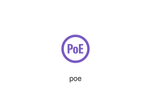
<div class="xal-ref-path">etc/resources/aws/svg/Yamaha-Network-Icons/poe.svg<br>69817 bytes</div>
</div>
</div>
{{#endtab}}
{{#tab name="Code"}}

```xml
{{#include ../samples/icons/Yamaha-Network-Icons/poe-17806c56.xal}}
```

{{#endtab}}
{{#endtabs}}

</div>
<div class="xal-ref-card">

{{#tabs name="svg-ref-0032"}}
{{#tab name="Preview"}}
<div class="xal-ref-preview">
<div>
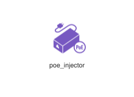
<div class="xal-ref-path">etc/resources/aws/svg/Yamaha-Network-Icons/poe_injector.svg<br>69817 bytes</div>
</div>
</div>
{{#endtab}}
{{#tab name="Code"}}

```xml
{{#include ../samples/icons/Yamaha-Network-Icons/poe-injector-00a8f2f1.xal}}
```

{{#endtab}}
{{#endtabs}}

</div>
<div class="xal-ref-card">

{{#tabs name="svg-ref-0033"}}
{{#tab name="Preview"}}
<div class="xal-ref-preview">
<div>

<div class="xal-ref-path">etc/resources/aws/svg/Yamaha-Network-Icons/pos_register.svg<br>69829 bytes</div>
</div>
</div>
{{#endtab}}
{{#tab name="Code"}}

```xml
{{#include ../samples/icons/Yamaha-Network-Icons/pos-register-0e992174.xal}}
```

{{#endtab}}
{{#endtabs}}

</div>
<div class="xal-ref-card">

{{#tabs name="svg-ref-0034"}}
{{#tab name="Preview"}}
<div class="xal-ref-preview">
<div>
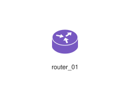
<div class="xal-ref-path">etc/resources/aws/svg/Yamaha-Network-Icons/router_01.svg<br>72638 bytes</div>
</div>
</div>
{{#endtab}}
{{#tab name="Code"}}

```xml
{{#include ../samples/icons/Yamaha-Network-Icons/router-01-47b5d8ea.xal}}
```

{{#endtab}}
{{#endtabs}}

</div>
<div class="xal-ref-card">

{{#tabs name="svg-ref-0035"}}
{{#tab name="Preview"}}
<div class="xal-ref-preview">
<div>
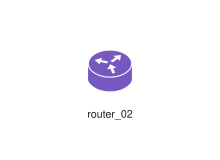
<div class="xal-ref-path">etc/resources/aws/svg/Yamaha-Network-Icons/router_02.svg<br>72638 bytes</div>
</div>
</div>
{{#endtab}}
{{#tab name="Code"}}

```xml
{{#include ../samples/icons/Yamaha-Network-Icons/router-02-0015a23a.xal}}
```

{{#endtab}}
{{#endtabs}}

</div>
<div class="xal-ref-card">

{{#tabs name="svg-ref-0036"}}
{{#tab name="Preview"}}
<div class="xal-ref-preview">
<div>
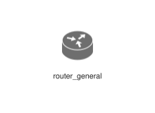
<div class="xal-ref-path">etc/resources/aws/svg/Yamaha-Network-Icons/router_general.svg<br>69829 bytes</div>
</div>
</div>
{{#endtab}}
{{#tab name="Code"}}

```xml
{{#include ../samples/icons/Yamaha-Network-Icons/router-general-7c0af0df.xal}}
```

{{#endtab}}
{{#endtabs}}

</div>
<div class="xal-ref-card">

{{#tabs name="svg-ref-0037"}}
{{#tab name="Preview"}}
<div class="xal-ref-preview">
<div>
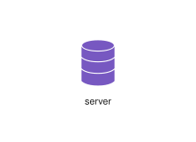
<div class="xal-ref-path">etc/resources/aws/svg/Yamaha-Network-Icons/server.svg<br>72617 bytes</div>
</div>
</div>
{{#endtab}}
{{#tab name="Code"}}

```xml
{{#include ../samples/icons/Yamaha-Network-Icons/server-91ca2e80.xal}}
```

{{#endtab}}
{{#endtabs}}

</div>
<div class="xal-ref-card">

{{#tabs name="svg-ref-0038"}}
{{#tab name="Preview"}}
<div class="xal-ref-preview">
<div>
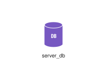
<div class="xal-ref-path">etc/resources/aws/svg/Yamaha-Network-Icons/server_db.svg<br>72617 bytes</div>
</div>
</div>
{{#endtab}}
{{#tab name="Code"}}

```xml
{{#include ../samples/icons/Yamaha-Network-Icons/server-db-b576d34a.xal}}
```

{{#endtab}}
{{#endtabs}}

</div>
<div class="xal-ref-card">

{{#tabs name="svg-ref-0039"}}
{{#tab name="Preview"}}
<div class="xal-ref-preview">
<div>
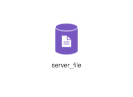
<div class="xal-ref-path">etc/resources/aws/svg/Yamaha-Network-Icons/server_file.svg<br>69829 bytes</div>
</div>
</div>
{{#endtab}}
{{#tab name="Code"}}

```xml
{{#include ../samples/icons/Yamaha-Network-Icons/server-file-06a21fc0.xal}}
```

{{#endtab}}
{{#endtabs}}

</div>
<div class="xal-ref-card">

{{#tabs name="svg-ref-0040"}}
{{#tab name="Preview"}}
<div class="xal-ref-preview">
<div>
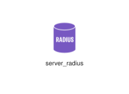
<div class="xal-ref-path">etc/resources/aws/svg/Yamaha-Network-Icons/server_radius.svg<br>72617 bytes</div>
</div>
</div>
{{#endtab}}
{{#tab name="Code"}}

```xml
{{#include ../samples/icons/Yamaha-Network-Icons/server-radius-5f9fc2f3.xal}}
```

{{#endtab}}
{{#endtabs}}

</div>
<div class="xal-ref-card">

{{#tabs name="svg-ref-0041"}}
{{#tab name="Preview"}}
<div class="xal-ref-preview">
<div>
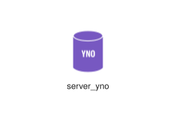
<div class="xal-ref-path">etc/resources/aws/svg/Yamaha-Network-Icons/server_yno.svg<br>72695 bytes</div>
</div>
</div>
{{#endtab}}
{{#tab name="Code"}}

```xml
{{#include ../samples/icons/Yamaha-Network-Icons/server-yno-ef45bf23.xal}}
```

{{#endtab}}
{{#endtabs}}

</div>
<div class="xal-ref-card">

{{#tabs name="svg-ref-0042"}}
{{#tab name="Preview"}}
<div class="xal-ref-preview">
<div>
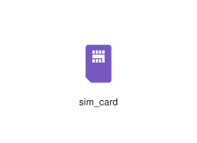
<div class="xal-ref-path">etc/resources/aws/svg/Yamaha-Network-Icons/sim_card.svg<br>72629 bytes</div>
</div>
</div>
{{#endtab}}
{{#tab name="Code"}}

```xml
{{#include ../samples/icons/Yamaha-Network-Icons/sim-card-d291604b.xal}}
```

{{#endtab}}
{{#endtabs}}

</div>
<div class="xal-ref-card">

{{#tabs name="svg-ref-0043"}}
{{#tab name="Preview"}}
<div class="xal-ref-preview">
<div>
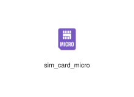
<div class="xal-ref-path">etc/resources/aws/svg/Yamaha-Network-Icons/sim_card_micro.svg<br>72617 bytes</div>
</div>
</div>
{{#endtab}}
{{#tab name="Code"}}

```xml
{{#include ../samples/icons/Yamaha-Network-Icons/sim-card-micro-0ba253d6.xal}}
```

{{#endtab}}
{{#endtabs}}

</div>
<div class="xal-ref-card">

{{#tabs name="svg-ref-0044"}}
{{#tab name="Preview"}}
<div class="xal-ref-preview">
<div>
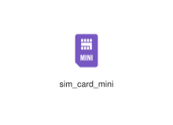
<div class="xal-ref-path">etc/resources/aws/svg/Yamaha-Network-Icons/sim_card_mini.svg<br>72629 bytes</div>
</div>
</div>
{{#endtab}}
{{#tab name="Code"}}

```xml
{{#include ../samples/icons/Yamaha-Network-Icons/sim-card-mini-8d4364cf.xal}}
```

{{#endtab}}
{{#endtabs}}

</div>
<div class="xal-ref-card">

{{#tabs name="svg-ref-0045"}}
{{#tab name="Preview"}}
<div class="xal-ref-preview">
<div>
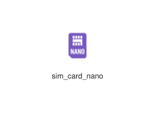
<div class="xal-ref-path">etc/resources/aws/svg/Yamaha-Network-Icons/sim_card_nano.svg<br>72617 bytes</div>
</div>
</div>
{{#endtab}}
{{#tab name="Code"}}

```xml
{{#include ../samples/icons/Yamaha-Network-Icons/sim-card-nano-bf63d8eb.xal}}
```

{{#endtab}}
{{#endtabs}}

</div>
<div class="xal-ref-card">

{{#tabs name="svg-ref-0046"}}
{{#tab name="Preview"}}
<div class="xal-ref-preview">
<div>
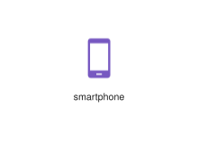
<div class="xal-ref-path">etc/resources/aws/svg/Yamaha-Network-Icons/smartphone.svg<br>72629 bytes</div>
</div>
</div>
{{#endtab}}
{{#tab name="Code"}}

```xml
{{#include ../samples/icons/Yamaha-Network-Icons/smartphone-593509a1.xal}}
```

{{#endtab}}
{{#endtabs}}

</div>
<div class="xal-ref-card">

{{#tabs name="svg-ref-0047"}}
{{#tab name="Preview"}}
<div class="xal-ref-preview">
<div>
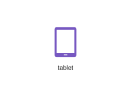
<div class="xal-ref-path">etc/resources/aws/svg/Yamaha-Network-Icons/tablet.svg<br>72629 bytes</div>
</div>
</div>
{{#endtab}}
{{#tab name="Code"}}

```xml
{{#include ../samples/icons/Yamaha-Network-Icons/tablet-1eaf63fe.xal}}
```

{{#endtab}}
{{#endtabs}}

</div>
<div class="xal-ref-card">

{{#tabs name="svg-ref-0048"}}
{{#tab name="Preview"}}
<div class="xal-ref-preview">
<div>
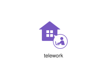
<div class="xal-ref-path">etc/resources/aws/svg/Yamaha-Network-Icons/telework.svg<br>69817 bytes</div>
</div>
</div>
{{#endtab}}
{{#tab name="Code"}}

```xml
{{#include ../samples/icons/Yamaha-Network-Icons/telework-d250e92c.xal}}
```

{{#endtab}}
{{#endtabs}}

</div>
<div class="xal-ref-card">

{{#tabs name="svg-ref-0049"}}
{{#tab name="Preview"}}
<div class="xal-ref-preview">
<div>

<div class="xal-ref-path">etc/resources/aws/svg/Yamaha-Network-Icons/utm_bridge.svg<br>69829 bytes</div>
</div>
</div>
{{#endtab}}
{{#tab name="Code"}}

```xml
{{#include ../samples/icons/Yamaha-Network-Icons/utm-bridge-3783bdf1.xal}}
```

{{#endtab}}
{{#endtabs}}

</div>
<div class="xal-ref-card">

{{#tabs name="svg-ref-0050"}}
{{#tab name="Preview"}}
<div class="xal-ref-preview">
<div>

<div class="xal-ref-path">etc/resources/aws/svg/Yamaha-Network-Icons/utm_router.svg<br>69829 bytes</div>
</div>
</div>
{{#endtab}}
{{#tab name="Code"}}

```xml
{{#include ../samples/icons/Yamaha-Network-Icons/utm-router-9e60cb0c.xal}}
```

{{#endtab}}
{{#endtabs}}

</div>
<div class="xal-ref-card">

{{#tabs name="svg-ref-0051"}}
{{#tab name="Preview"}}
<div class="xal-ref-preview">
<div>

<div class="xal-ref-path">etc/resources/aws/svg/Yamaha-Network-Icons/virtual_router.svg<br>72617 bytes</div>
</div>
</div>
{{#endtab}}
{{#tab name="Code"}}

```xml
{{#include ../samples/icons/Yamaha-Network-Icons/virtual-router-3a2d3147.xal}}
```

{{#endtab}}
{{#endtabs}}

</div>
<div class="xal-ref-card">

{{#tabs name="svg-ref-0052"}}
{{#tab name="Preview"}}
<div class="xal-ref-preview">
<div>

<div class="xal-ref-path">etc/resources/aws/svg/Yamaha-Network-Icons/virtual_server.svg<br>72617 bytes</div>
</div>
</div>
{{#endtab}}
{{#tab name="Code"}}

```xml
{{#include ../samples/icons/Yamaha-Network-Icons/virtual-server-dd9bc8d7.xal}}
```

{{#endtab}}
{{#endtabs}}

</div>
<div class="xal-ref-card">

{{#tabs name="svg-ref-0053"}}
{{#tab name="Preview"}}
<div class="xal-ref-preview">
<div>

<div class="xal-ref-path">etc/resources/aws/svg/Yamaha-Network-Icons/virtual_server_db.svg<br>72617 bytes</div>
</div>
</div>
{{#endtab}}
{{#tab name="Code"}}

```xml
{{#include ../samples/icons/Yamaha-Network-Icons/virtual-server-db-c8cdde3b.xal}}
```

{{#endtab}}
{{#endtabs}}

</div>
<div class="xal-ref-card">

{{#tabs name="svg-ref-0054"}}
{{#tab name="Preview"}}
<div class="xal-ref-preview">
<div>

<div class="xal-ref-path">etc/resources/aws/svg/Yamaha-Network-Icons/virtual_server_file.svg<br>72617 bytes</div>
</div>
</div>
{{#endtab}}
{{#tab name="Code"}}

```xml
{{#include ../samples/icons/Yamaha-Network-Icons/virtual-server-file-4e375671.xal}}
```

{{#endtab}}
{{#endtabs}}

</div>
<div class="xal-ref-card">

{{#tabs name="svg-ref-0055"}}
{{#tab name="Preview"}}
<div class="xal-ref-preview">
<div>

<div class="xal-ref-path">etc/resources/aws/svg/Yamaha-Network-Icons/virtual_server_radius.svg<br>72617 bytes</div>
</div>
</div>
{{#endtab}}
{{#tab name="Code"}}

```xml
{{#include ../samples/icons/Yamaha-Network-Icons/virtual-server-radius-ad41ecab.xal}}
```

{{#endtab}}
{{#endtabs}}

</div>
<div class="xal-ref-card">

{{#tabs name="svg-ref-0056"}}
{{#tab name="Preview"}}
<div class="xal-ref-preview">
<div>

<div class="xal-ref-path">etc/resources/aws/svg/Yamaha-Network-Icons/vpc.svg<br>72617 bytes</div>
</div>
</div>
{{#endtab}}
{{#tab name="Code"}}

```xml
{{#include ../samples/icons/Yamaha-Network-Icons/vpc-09901c82.xal}}
```

{{#endtab}}
{{#endtabs}}

</div>
<div class="xal-ref-card">

{{#tabs name="svg-ref-0057"}}
{{#tab name="Preview"}}
<div class="xal-ref-preview">
<div>
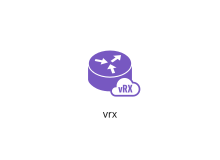
<div class="xal-ref-path">etc/resources/aws/svg/Yamaha-Network-Icons/vrx.svg<br>72617 bytes</div>
</div>
</div>
{{#endtab}}
{{#tab name="Code"}}

```xml
{{#include ../samples/icons/Yamaha-Network-Icons/vrx-53681b1a.xal}}
```

{{#endtab}}
{{#endtabs}}

</div>
<div class="xal-ref-card">

{{#tabs name="svg-ref-0058"}}
{{#tab name="Preview"}}
<div class="xal-ref-preview">
<div>
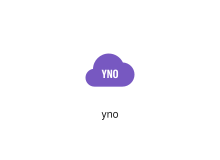
<div class="xal-ref-path">etc/resources/aws/svg/Yamaha-Network-Icons/yno.svg<br>72617 bytes</div>
</div>
</div>
{{#endtab}}
{{#tab name="Code"}}

```xml
{{#include ../samples/icons/Yamaha-Network-Icons/yno-03f4e281.xal}}
```

{{#endtab}}
{{#endtabs}}

</div>
</div>
