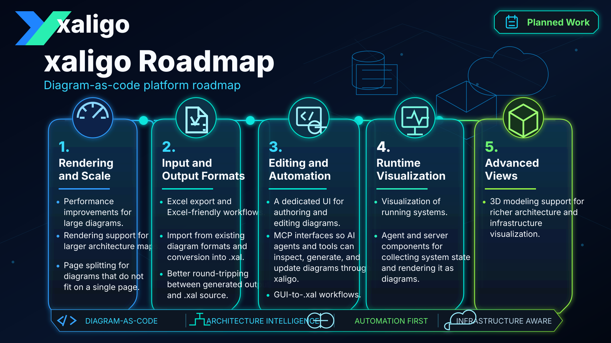

# Planned Work

xaligo is being developed as a diagram-as-code platform for architecture,
network, and operational visualization workflows. The items below are planned
or under consideration and may change as the core renderer evolves.

## Rendering and Scale

- Performance improvements for large diagrams.
- Rendering support for larger architecture maps.
- Page splitting for diagrams that do not fit on a single page.

## Input and Output Formats

- Excel export and Excel-friendly workflows.
- Import from existing diagram formats and conversion into `.xal`.
- Better round-tripping between generated output and `.xal` source.

## Editing and Automation

- A dedicated UI for authoring and editing diagrams.
- MCP interfaces so AI agents and tools can inspect, generate, and update
  diagrams through xaligo.
- GUI-to-`.xal` workflows, including configuration changes driven from visual
  edits.

## Runtime Visualization

- Visualization of running systems.
- Agent and server components for collecting system state and rendering it as
  diagrams.

## Advanced Views

- 3D modeling support for richer architecture and infrastructure
  visualization.
