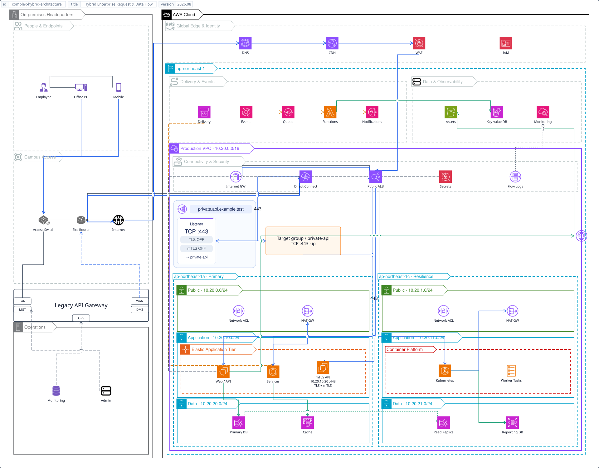

# Samples

## Canonical V1 Envelope

The [canonical V1 envelope example](examples/canonical-v1-envelope.md) shows
the current document hierarchy, document-wide `<data>`, identified frames, and
default per-frame SVG output.

## Cross-Frame Page Links

The [cross-frame page-link example](examples/page-links.md) demonstrates local
page stubs, `to <frame ID>` / `from <frame ID>` labels, and multi-page render
commands. Detailed anchor rules live in the
[Arrow Reference](reference/arrows/anchors-bends.md).

## Frame Metadata Tags

The [frame metadata example](examples/frame-metadata.md) shows built-in
`id`/`title`/content-`version` tags, custom entries, top/bottom placement, and
page links that route around metadata reservations. Detailed metadata rules
live in the [Frame Reference](reference/frames/attributes.md).

## Hybrid Enterprise Architecture


This sample combines the larger network-routing showcase with canonical V1
page metadata. Its frame declares a stable `id`, visible `title`, and content
`version`, so the built-in metadata band reserves its edge strip while the
existing route/traffic lanes, line jumps, junctions, and manual bends continue
to use the shared routing pipeline.

Source: [`docs/src/examples/samples/complex-hybrid-architecture.xal`](examples/samples/complex-hybrid-architecture.xal)

```bash
xaligo render docs/src/examples/samples/complex-hybrid-architecture.xal \
  --format svg \
  --mode network \
  -o output/complex-hybrid-architecture.svg
```

### V2: Private NLB TCP Passthrough



The V2 sample embeds the [NLB passthrough component](examples/samples/aws/aws-elastic-load-balancing-network-load-balancer/passthrough.xal)
into the private request path: on-premises → Direct Connect → NLB TCP:443
listener → IP target group → API at `10.20.10.20:443` in the primary application
subnet. TLS and mTLS terminate at the API, not at the NLB. The public ALB path
remains separate. The taller canvas accommodates the native listener card.
This component requires V2; the V1 example above is unchanged.

[Editable XAL](examples/samples/complex-hybrid-architecture-v2.xal) ·
[SVG](examples/samples/complex-hybrid-architecture-v2.svg)

```bash
xaligo render docs/src/examples/samples/complex-hybrid-architecture-v2.xal \
  --format svg \
  -o docs/src/examples/samples/complex-hybrid-architecture-v2.svg
```

## Structural Diff

This pair demonstrates a title update, an element moved between groups, a
removed legacy store, an added cache, and changed connections. The comparison
uses parsed `.xal` structure rather than text lines.

### Removed and previous values


### Added and current values


Sources:

- [`diff-before.xal`](examples/samples/diff-before.xal)
- [`diff-after.xal`](examples/samples/diff-after.xal)

```bash
xaligo diff \
  docs/src/examples/samples/diff-before.xal \
  docs/src/examples/samples/diff-after.xal \
  -o docs/src/images/diff-sample
```

The command reports `+2 -2 ~3`: two added branches, two removed branches, and
three modified or moved elements. The old SVG uses pale red and the new SVG
uses pale green; unchanged elements retain their normal styling.

## Route and Traffic Separation

Use `kind="route"` for structural paths without arrowheads, then add
`kind="traffic"` connections over the same endpoints for directional flows.
Traffic lines are drawn beside the matching route lane when possible.

Source: [`docs/src/examples/samples/route-traffic.xal`](examples/samples/route-traffic.xal)

```bash
xaligo render docs/src/examples/samples/route-traffic.xal \
  --format svg \
  --mode network \
  -o output/route-traffic.svg
```

## Generated AWS Hierarchy

Generate a starter AWS hierarchy and render it:

```bash
xaligo generate xal --clouds 1 --accounts 1 --regions 2 --azs 2 \
  --az-layout staggered --subnets 2 --spacing both --start top \
  --paper A4 --orientation landscape -o output/infra.xal

xaligo render output/infra.xal \
  --format svg \
  -o output/infra.svg \
  --services docs/src/examples/samples/services.csv
```
