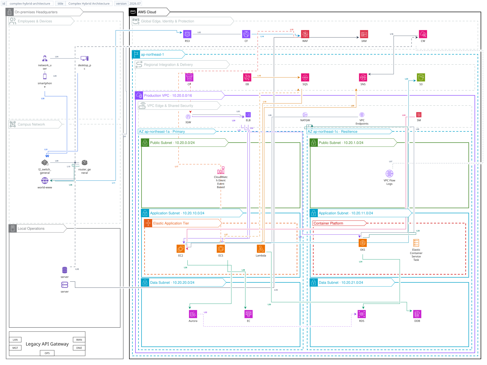
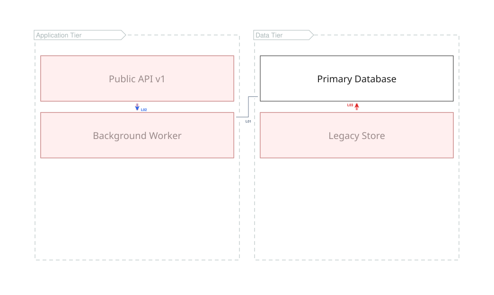
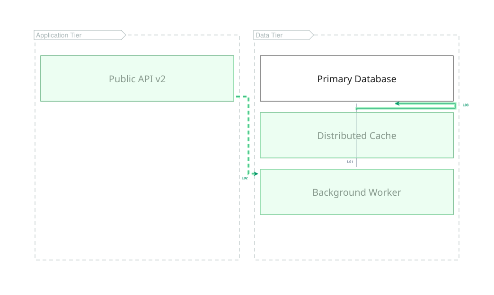
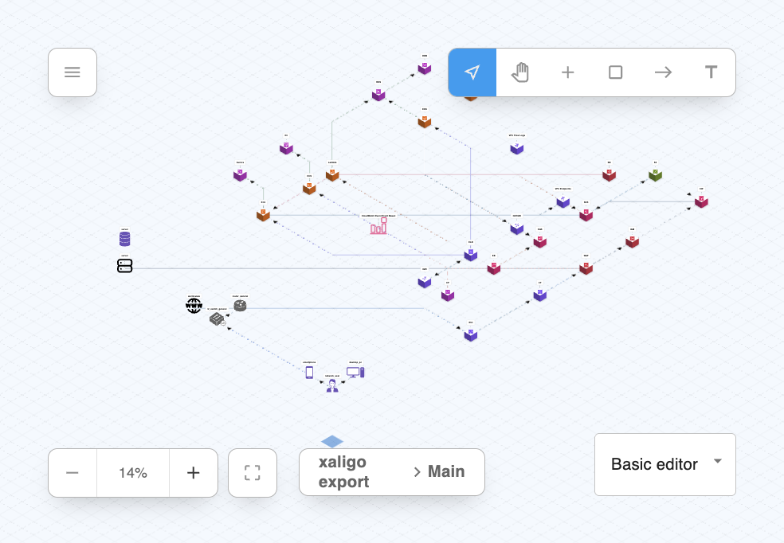

# Samples

## Canonical V1 Envelope

The [canonical V1 envelope example](examples/canonical-v1-envelope.md) uses
`<xaligo version="1">`, the document-wide `<data>` registry, identified frames,
ports, and a cross-frame connection without producing a legacy-root warning.

## Cross-Frame Page Links

The [cross-frame page-link example](examples/page-links.md) demonstrates both
automatic nearest-border selection and explicit side/anchor selection. It also
shows the exact `to <frame ID>` and `from <frame ID>` labels generated on each
page-local stub.

## Hybrid Enterprise Architecture



Source: [`docs/src/examples/samples/complex-hybrid-architecture.xal`](examples/samples/complex-hybrid-architecture.xal)

```bash
xaligo render docs/src/examples/samples/complex-hybrid-architecture.xal \
  --format svg \
  --mode network \
  -o output/complex-hybrid-architecture.svg
```

## Structural Diff

This pair demonstrates a title update, an element moved between groups, a
removed legacy store, an added cache, and changed connections. The comparison
uses parsed `.xal` structure rather than text lines.

### Removed and previous values



### Added and current values



Sources:

- [`diff-before.xal`](examples/samples/diff-before.xal)
- [`diff-after.xal`](examples/samples/diff-after.xal)

```bash
xaligo diff \
  docs/src/examples/samples/diff-before.xal \
  docs/src/examples/samples/diff-after.xal \
  -o docs/src/images/diff-sample
```

The command reports `+2 -2 ~3`: two added branches, two removed branches, and
three modified or moved elements. The old SVG uses pale red and the new SVG
uses pale green; unchanged elements retain their normal styling.

## Isoflow Export



Use the same `.xal` source to generate an Isoflow-compatible model:

```bash
xaligo render docs/src/examples/samples/complex-hybrid-architecture.xal \
  --format isoflow \
  --mode network \
  -o output/complex-hybrid-architecture.isoflow.json
```

## Route and Traffic Separation

Use `kind="route"` for structural paths without arrowheads, then add
`kind="traffic"` connections over the same endpoints for directional flows.
Traffic lines are drawn beside the matching route lane when possible.

Source: [`docs/src/examples/samples/route-traffic.xal`](examples/samples/route-traffic.xal)

```bash
xaligo render docs/src/examples/samples/route-traffic.xal \
  --format svg \
  --mode network \
  -o output/route-traffic.svg
```

## Generated AWS Hierarchy

Generate a starter AWS hierarchy and render it:

```bash
xaligo generate xal --clouds 1 --accounts 1 --regions 2 --azs 2 \
  --az-layout staggered --subnets 2 --spacing both --start top \
  --paper A4 --orientation landscape -o output/infra.xal

xaligo render output/infra.xal \
  --format excalidraw \
  -o output/infra.excalidraw \
  --services docs/src/examples/samples/services.csv
```
